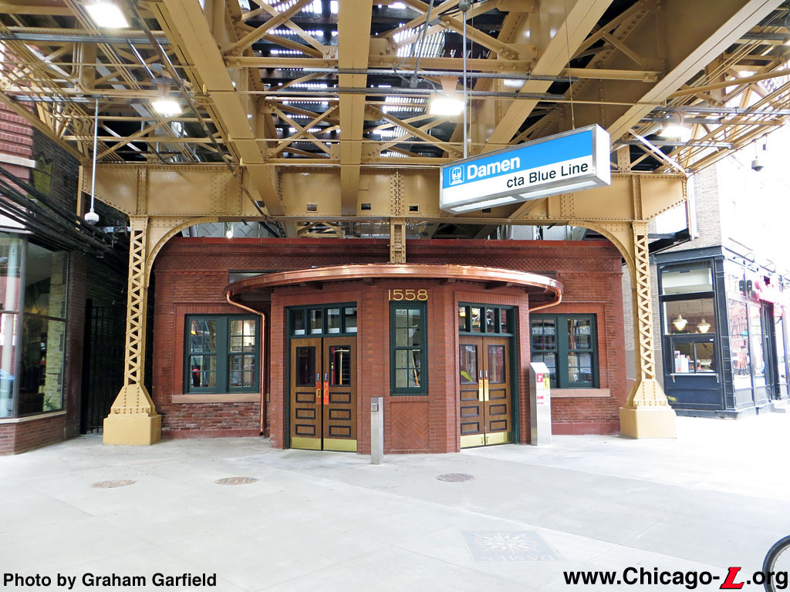

# This is my website README

## My home is former location of Metropolitan West Grand Street Station

The Met West Grand station (no image availabe) was the same style as the Blue Line Damen station pictured above

Research on my new home at 513 N Hermitage Ave.</h1>     After some research, I discovered that my current home that was built 2 years ago, stands on the ground of what was the Grand Street station of the now defunct Metropolitan West Side Elevated Railroad. The Met West was a 3.6 mile elevated train that eventually became part of the CTA Blue Line. The Met West was built in 1895 and was in
operation until 1958.

[Wiki article on the Grand Street Station](https://en.wikipedia.org/wiki/Grand_station_(CTA_Logan_Square_branch)#:~:text=Grand%20was%20a%20rapid%20transit,service%20on%20May%206%2C%201895.)

[Map of the now defunct Metropolitan West (Met West) line](https://www.google.com/maps/d/viewer?hl=en&amp;gl=us&amp;ie=UTF8&amp;ptab=2&amp;oe=UTF8&amp;msa=0&amp;ll=41.8910404932203%2C-87.67032823551367&amp;spn=0.317372%2C0.508118&amp;z=18&amp;mid=1TfjR0R9GrR-LQE-DMl0W46yauB4)
